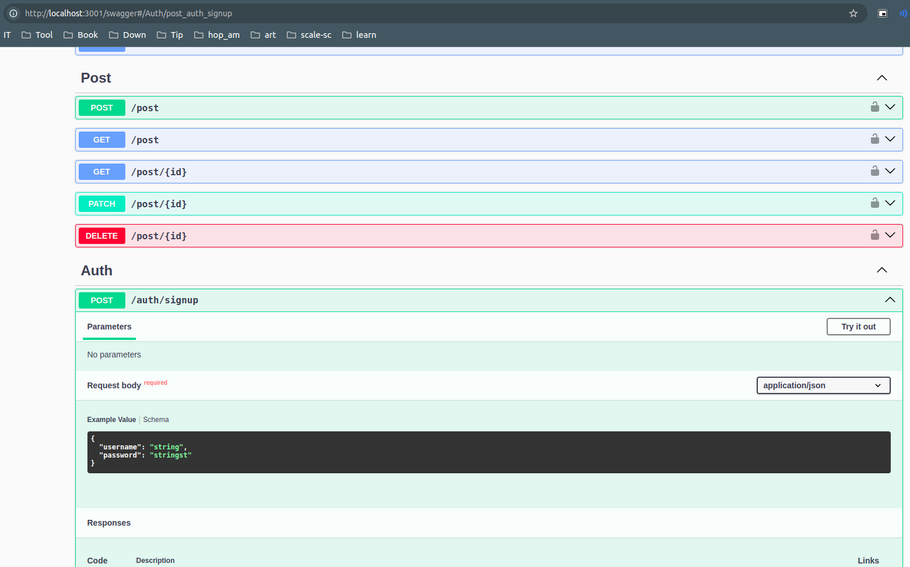

## Development
- clone source code
- change .env.example to .env
- run command `npm install` to install all dependencies
- comment service ysp-server-nestjs in docker-compose.yaml file
- run command: `docker compose up -d` to init database and redis service
- run command: `npm run swagger:generate` (view in scripts of package.json file) to generate swagger doc (swagger.json)
- run command: `npm run start:dev`

## Production
- create own .env.prod file
- uncomment service ysp-server-nestjs in docker-compose.yaml file
- change servers > urls in nestia.config.js file to your production domain like SERVER_DOMAIN_URL in file .env
- run command: `npm run swagger:generate`
- replace file swagger.fix.json into file swagger.json api Post /post > requestBody
- run command: `docker compose up -d`
- then you will bring this image to every deployment environment

## Swagger
- http://{domain}/swagger (For example: `http://localhost:3000/swagger`)

- 
